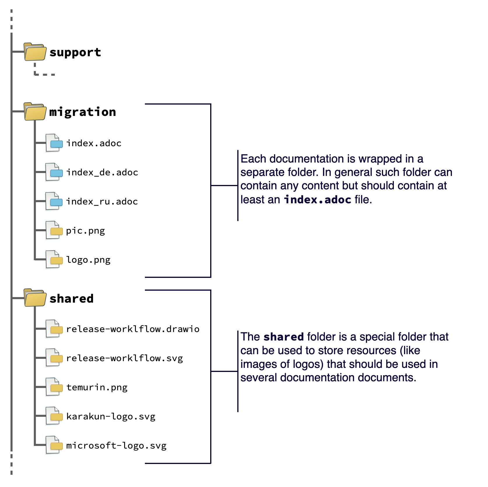
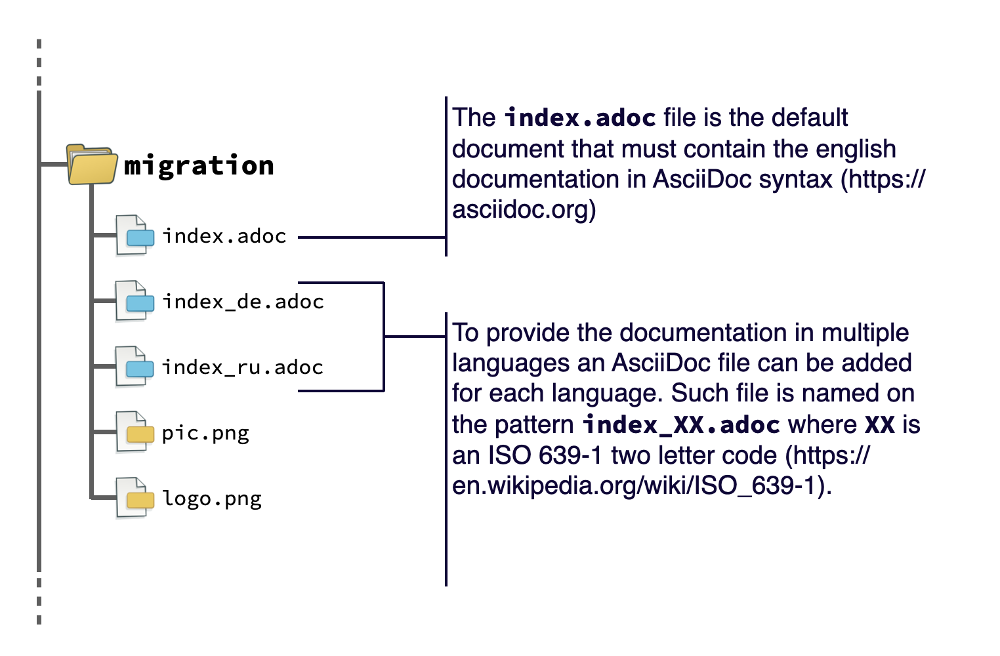

# website-adoptium-documentation

This contains the new documentation for [adoptium.net](https://adoptium.net).

The documentation is based on [asciidoc](https://docs.asciidoctor.org/asciidoc/latest/). An html documentation can be created by calling the `build.sh` script on linux or mac. To do so [asciidoctor needs to be installed](https://docs.asciidoctor.org/asciidoctor/latest/install/) on the system. 

## Structure of the repository

Each documentation topic is defined by a folder that is named by the topic (technical name). 
Each folder contains the Asciidoc files (*.adoc) and resources like images that belong to the topic.
General resources that will be used in several topics should be stored in a special folder named “shared”.

Since we want to support i18n directly from the beginning a folder can contain multiple AsciiDoc files in different languages.
The index.adoc file should always be part of a folder and should contain the english documentation.
This will be the default language that will be used if the requested language is not available.
The AsciiDoc file for a specific language is called index_XX.adoc where XX defines the iso code of the language that is used in the file.

A common problem in documentation is the reuse and modification of images and diagrams.
Therefore draw.io should be used wherever possible to create illustrations that are needed for the documentation.
Next to this SVG should be used whenever possible instead of using pixel based images.
For such pixel based images PNG should be used and such images should have a transparent background.

