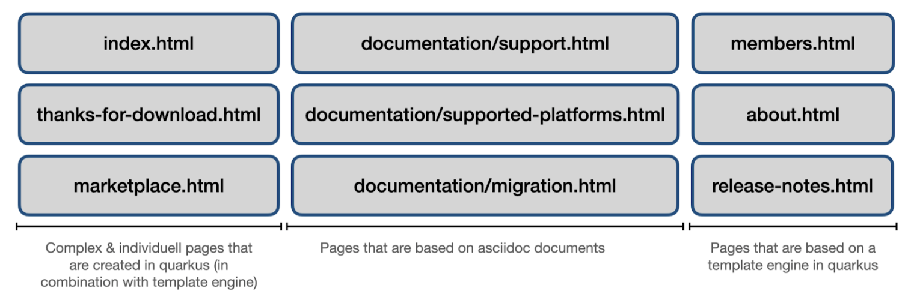
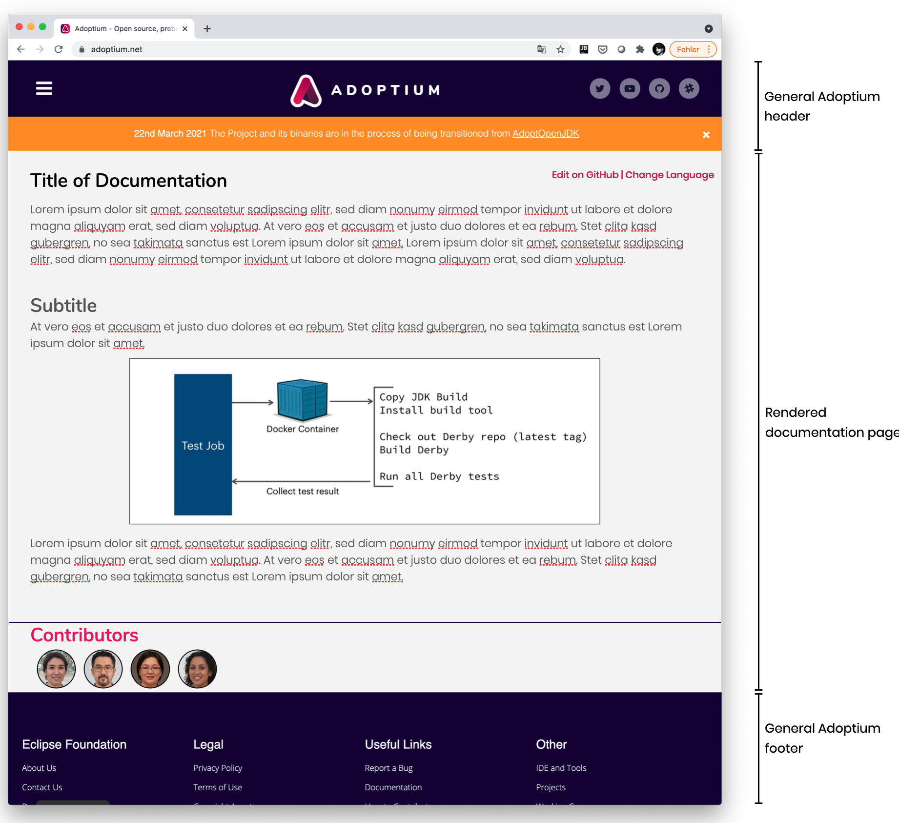
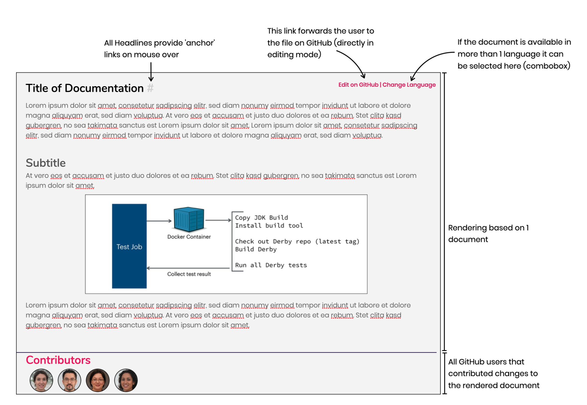
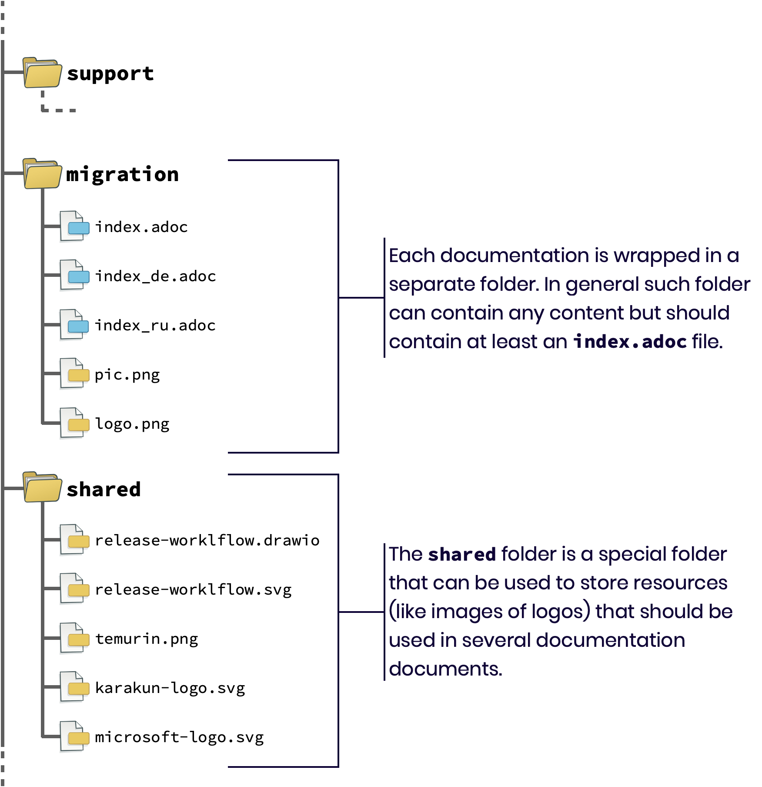
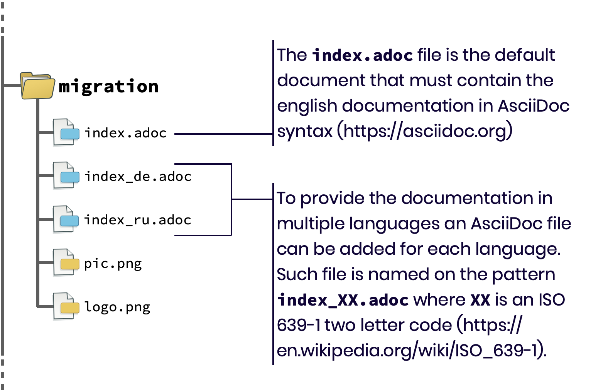
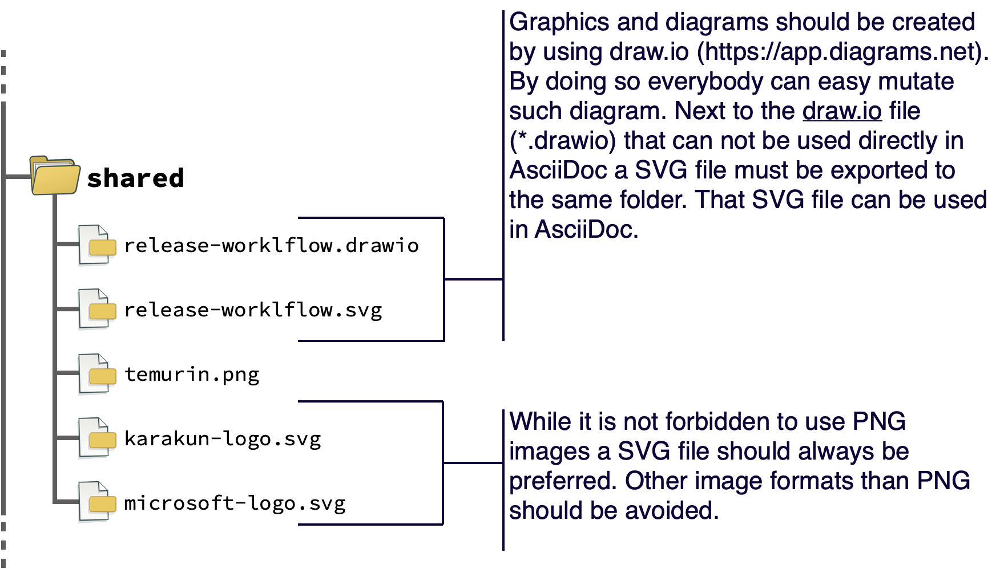
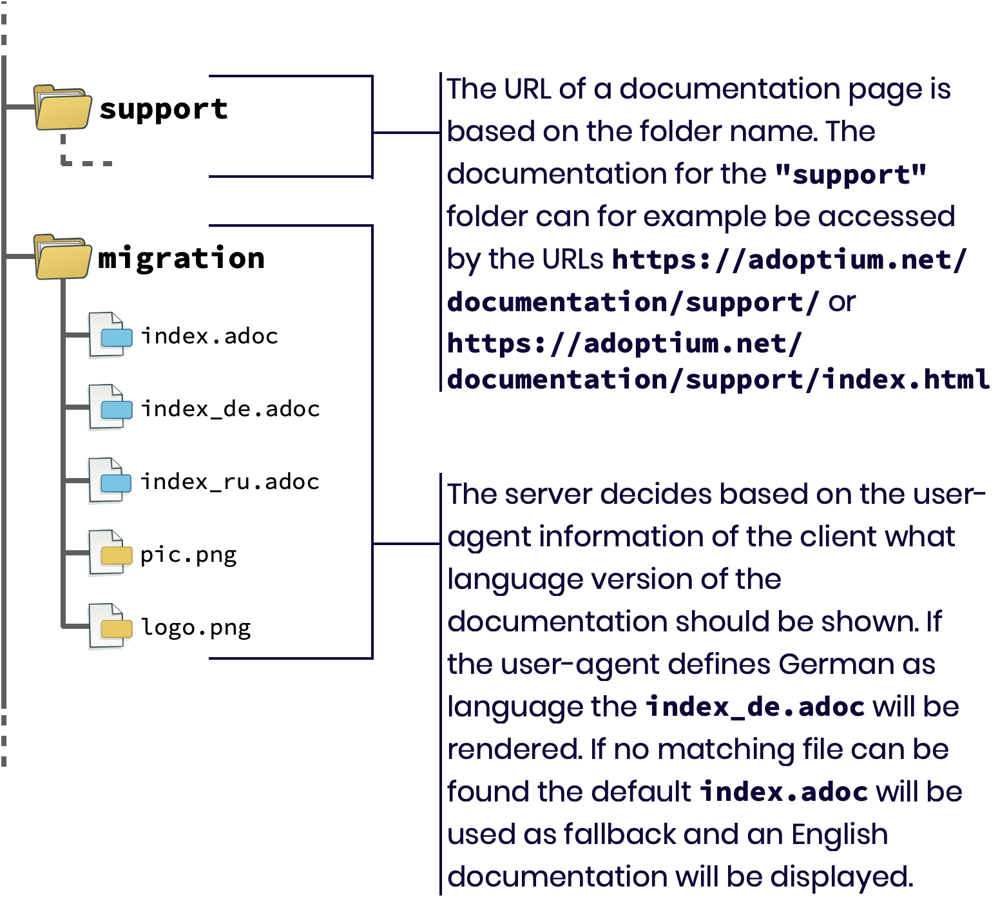
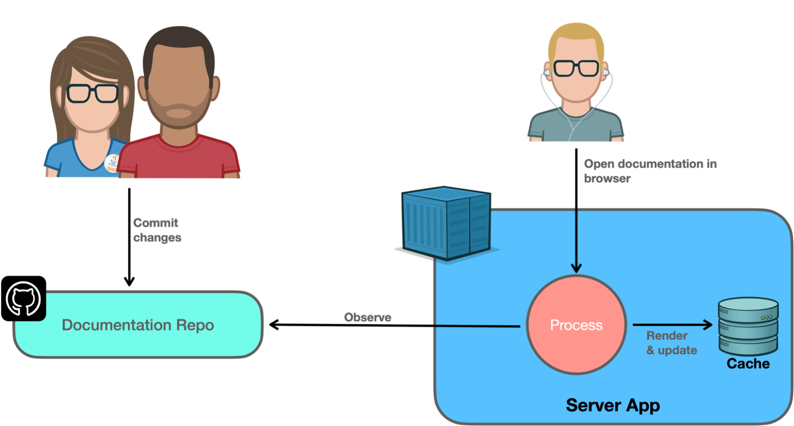

= Adoptium.net documentation visualization and structure
:icons: font
:sectanchors: 
:url-repo: https://github.com/AdoptOpenJDK/website-adoptium-documentation
:hide-uri-scheme:

Adoptium.net will provide several documentations: For non technical end users the page needs to provide multilingual manuals for installing Temurin.
Next to this we want to provide (technical) documentation for contributors or information regarding the licence of Temurin for system administrators and IT managers.
These are just some examples of the different documentations that need to be hosted at Adoptium.net. The following image shows an overview of the planned Adoptium.net page.

== Definition of documentation

As you can see the sitemap is separated into 3 different types of pages.
This document defines the 2nd type of pages that are based on asciidoc documents.
The 3 given endpoints (`support.html`, `supported-platforms.html`, `migration.html`) are just examples but can be used as initial documents for an implementation of the given features.
All 3 documents are already part of https://adoptopenjdk.net and the content can easily be copied for now.

Since we target different personas by the page and documentation it doesn't make sense to provide a single big document.
Instead of this the website should provide the functionality to render single documents.
A document is normally an asciidoc file that can contain (include) other asciidoc files and resources like images.
Such documents should be rendered and integrated as part of the Adoptium.net webpage.

The URL should define the document that must be rendered.
While the concrete scheme is not defined yet we can start with the following definition:

* The URL `https://adoptium.net/documentation/doc1.html` will render the `index.adoc` file in the `/documentation/doc1/` folder of the website git repo.
* A language param can be added to the URL to show the documentation in a specific language. 
In such a case the result of another adoc file will be rendered. Let’s assume we want to show the already mentioned `doc1.html` in German. if the  `/documentation/doc1/` folder contains an  `index_de.adoc` file that file will be used.
We will always have a fallback to the index.adoc file.

Since Adoptium.net is an open source project we want to make it as easy as possible to contribute to the documentation.
To do so we add an ”Edit on Github” button to each page. The button will link the user directly to the asciidoc document at GitHub and open it in editing mode (if possible).
An example of such behavior can be found at https://next.adoptopenjdk.net/migration (see link at bottom of the page) or at https://nodejs.org/en/docs/guides/getting-started-guide/.
A link to edit a file directly can be based on a simple simple pattern: 

`https://github.com/[TEAM]/[REPO]/edit/master/src/documenation/[DOC-NAME]/index.adoc`

Since we want to honor the work that people did on the documentation at Adoptium.net we will show the GitHub profiles of all contributors at the bottom of the page.
Each profile links directly to the user page at GitHub.
This feature is optional for Version 1 and can be added on a future milestone.

In Version 1 all documents can be rendered at build-time.
In general this should end in 1 HTML file per documentation that should include the page header and footer.

== Structure of the documentation files

The documentation will be based on AsciiDoc.
Each documentation topic is defined by a folder that is named by the topic (technical name). 
Each folder contains the Asciidoc files and resources like images that belong to the topic. 
General resources that will be used in several topics should be stored in a special folder named “shared”.

Since we want to support i18n directly from the beginning a folder can contain multiple AsciiDoc files in different languages.
The index.adoc file should always be part of a folder and should contain the english documentation.
This will be the default language that will be used if the requested language is not available.
The AsciiDoc file for a specific language is called `index_XX.adoc` where `XX` defines the iso code of the language that is used in the file.

A common problem in documentation is the reuse and modification of images and diagrams. 
Therefore draw.io should be used wherever possible to create illustrations that are needed for the documentation.
Next to this SVG should be used whenever possible instead of using pixel based images.
For such pixel based images PNG should be used and such images should have a transparent background. 

== How the documentation is rendered

== Possible next steps

The following steps should be created as issues.
Mostly all of them are “good first issue” issues and therefore a good documentation is needed (images, etc. can be reused from this document):
* Create a documentation repository that contains sample documentation (best would be a copy of the “migration”, “supported platforms”, and “support” pages from adoptopenjdk.net.
If everything is configured correctly the rendered documentation files should already look quite in the GitHub view. (See https://github.com/AdoptOpenJDK/website-adoptium/issues/120[AdopOpenJDK website adoptium issue 120])
* Provide a GitHub Action for the documentation repository that creates a rendered html documentation in a separate branch that can be used for GitHub pages.
While we might not need that Action and the result for the final page it’s quite useful to have a generated result as fast as possible.
* Create a sample Service (based on Eclipse Microprofile APIs) that observes a GIT repository and updates a local copy of the repository on the local file system.
This can be done either by using a Git wrapper like JGit or by using the GitHub REST API.
* We need to define how the final URLs / endpoints / REST API of the documentation will look like.
A sample (based on Eclipse Microprofile APIs) should be created that can be used to access the rendered documentation.
* Next to the plain text content a documentation file needs some metadata like the title or information for social media and search engines.
AsciiDoc supports the definition of metadata in files.
We need to define a template document that contains all the metadata properties that are needed for a rich user experience and integration in other platforms and media.
